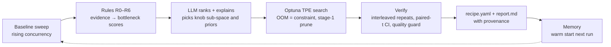

<p align="center">
  <picture>
    <source media="(prefers-color-scheme: dark)" srcset="assets/logo-dark.svg">
    
  </picture>
</p>

<p align="center">
  <a href="https://github.com/vageeshadatta2000/infervolt/actions/workflows/ci.yml"></a>
  <a href="LICENSE"></a>
  
  
  <a href="https://github.com/vageeshadatta2000/infervolt/issues?q=is%3Aissue+is%3Aclosed"></a>
  <a href="https://github.com/vageeshadatta2000/infervolt/issues"></a>
  <a href="https://github.com/vageeshadatta2000/infervolt/stargazers"></a>
  <a href="https://deepwiki.com/vageeshadatta2000/infervolt"></a>
</p>

---

<p align="center">
  <a href="docs/superpowers/specs/2026-09-01-infervolt-design.md"><b>Design doc</b></a> |
  <a href="ROADMAP.md"><b>Roadmap</b></a> |
  <a href="https://github.com/vageeshadatta2000/infervolt/discussions"><b>Discussions</b></a> |
  <a href="https://github.com/vageeshadatta2000/infervolt/issues"><b>Issues</b></a> |
  <a href="CHANGELOG.md"><b>Changelog</b></a> |
  <a href="CONTRIBUTING.md"><b>Contributing</b></a> |
  <a href="SECURITY.md"><b>Security</b></a>
</p>

## News

- [2026/09] 🔥 **v0.1.0-dev**: the full loop runs end to end on a roofline-based mock engine. Four injected bottlenecks (KV capacity, decode bandwidth, prefill compute, scheduler overhead) are diagnosed and fixed with CI-separated wins; 280 tests, CI green on Linux and macOS.
- [2026/09] Design published: evidence-first diagnosis, an LLM that only chooses knob sub-spaces and priors, Optuna inside that sub-space, and interleaved verification with a paired confidence interval ([design doc](docs/superpowers/specs/2026-09-01-infervolt-design.md)).
- [2026/09] Project started after a survey of 30+ inference-tuning tools and papers; none combine real measurement, bottleneck attribution, recipe output, and cross-run memory ([landscape table](docs/superpowers/specs/2026-09-01-infervolt-design.md#landscape-what-exists-and-the-gap)).

<details>
<summary>More</summary>

- Milestones: [M2 llama.cpp](https://github.com/vageeshadatta2000/infervolt/milestone/1) · [M3 vLLM on Thunder](https://github.com/vageeshadatta2000/infervolt/milestone/2) · [M4 memory + continuous](https://github.com/vageeshadatta2000/infervolt/milestone/3) · [M5 docs + PyPI](https://github.com/vageeshadatta2000/infervolt/milestone/4)

</details>

## About

**Measure → diagnose the bottleneck → targeted fix → re-measure → verify → emit a recipe → remember.**

infervolt is an open-source agent that optimizes inference for open-source LLMs on *your* hardware and explains *why* the winning configuration wins. It is the real-measurement, explanation-emitting, engine-agnostic complement to tools that only model (NVIDIA aiconfigurator), only diagnose (vLLM Doctor), or only search (auto-tuning-vllm).

What you get from one `infervolt optimize` run:

- **`recipe.yaml`**: engine-native serve args, before/after metrics at their load points, the diagnosis with the evidence keys behind it, the search summary, and provenance (tool version, LLM, prompt hash).
- **`report.md`**: a human-readable explanation of the bottleneck, the winning knobs, the confidence interval on the improvement, and next steps.
- **Memory** (M4): each run warm-starts the next one on similar models, hardware, and workloads.

Status: **pre-alpha**. The loop is complete and tested against a roofline-based mock engine. llama.cpp and vLLM adapters are next ([ROADMAP.md](ROADMAP.md)).

## 60-second demo (no GPU, no API key)

```bash
uv sync --extra dev
uv run infervolt optimize --engine mock --model mock/qwen3-8b --hardware rtx4090-24 \
  --workload chat-4k-512 --slo ttft=600ms,itl=30ms --llm fake --max-trials 8
```

Real output from that command (under one second):

```text
baseline goodput 0.344 rps at c=4
primary bottleneck: kv_capacity (confidence 0.95); findings: R1=1.00, R2=0.70, R3=0.40
search plan: subspaces=['kv'] priors=3 max_trials=8
verify: ACCEPTED +0.907 rps, from a baseline that served nothing at c=16 (95% CI +0.899..+0.915 rps at c=16)
recipe: ~/.infervolt/runs/2026-09-03T03-20-28Z-0198/recipe.yaml
report: ~/.infervolt/runs/2026-09-03T03-20-28Z-0198/report.md
```

Swap `--llm anthropic` (set `INFERVOLT_ANTHROPIC_API_KEY` or `ANTHROPIC_API_KEY`) or `--llm openai` (any OpenAI-compatible endpoint, including a local vLLM) for real reasoning. Copy `.env.example` to `.env` for the settings.

## How it works



1. **Baseline sweep** at rising concurrency, recording client-side TTFT and per-token latency, engine counters, and GPU activity.
2. **Rules** (R0–R6) score bottleneck signatures from evidence: KV capacity, prefill compute, decode bandwidth, scheduler/CPU, communication, client artifact. Missing counters never make a rule fire.
3. **LLM ranks and explains** the findings and picks the knob sub-space and a few prior candidates. It can only name knobs it was shown; every reply is schema-validated, and any LLM failure degrades to rule order.
4. **Optuna TPE** searches inside that sub-space. OOMs are constraints: a weights OOM raises the memory-utilization floor, a KV-capacity OOM tightens the token ceilings. Cheap stage-1 runs at the saturation point prune weak candidates before the full sweep.
5. **Verify**: three interleaved baseline/candidate repeats; a win needs a confidence interval on goodput that excludes zero and a minimum effect size, plus a quality guard whenever numerics change (KV dtype, quantization, speculation).
6. **Recipe and report** with provenance. Cross-run memory and continuous re-tuning arrive in M4.

## Compared to

| Tool | Runs real benchmarks | Attributes the bottleneck | Emits a recipe with evidence | Learns across runs |
|---|---|---|---|---|
| NVIDIA aiconfigurator | no (analytic) | no | manifests, no evidence | no |
| vLLM Doctor | reads metrics only | rules | no | local history only |
| auto-tuning-vllm / llm-optimizer | yes | no | config only | per-study |
| **infervolt** | yes | rules + LLM, evidence-backed | yes | M4 |

## Roadmap

| Milestone | Scope | Status |
|---|---|---|
| M1 | Mock-engine loop end to end, CPU-only CI | ✅ done |
| [M2](https://github.com/vageeshadatta2000/infervolt/milestone/1) | llama.cpp adapter, multi-process HTTP load generator, Apple Silicon detection | next |
| [M3](https://github.com/vageeshadatta2000/infervolt/milestone/2) | vLLM adapter on Thunder Compute, lm-eval quality guard, budget guard | planned |
| [M4](https://github.com/vageeshadatta2000/infervolt/milestone/3) | Cross-run memory, warm start, `watch` mode for new engine releases and drift | planned |
| [M5](https://github.com/vageeshadatta2000/infervolt/milestone/4) | Docs site, committed recipes, PyPI release | planned |

Later: SGLang and TensorRT-LLM adapters, disaggregated prefill/decode and wide-EP recipes.

## Acknowledgements

The design draws on published work; infervolt aims to be the measured, explained complement to it.

- [SLO-Guard](https://arxiv.org/abs/2604.17627): crashes as constraints in serving-config search.
- [NVIDIA aiconfigurator](https://github.com/ai-dynamo/aiconfigurator) and [Vidur](https://arxiv.org/abs/2405.05465): analytic and simulated config search.
- [vLLM Doctor](https://github.com/vllm-doctor/vllm-doctor): rule-based diagnosis from Prometheus metrics.
- [LLAMBO](https://arxiv.org/abs/2402.03921) and the "Centaur" hybrid study ([arXiv 2603.24647](https://arxiv.org/abs/2603.24647)): LLM priors plus a classical optimizer.
- [InferenceX](https://github.com/SemiAnalysisAI/InferenceX): the nightly public inference leaderboard.
- Red Hat's [quantization recovery study](https://developers.redhat.com/articles/2024/10/17/we-ran-over-half-million-evaluations-quantized-llms): the accuracy-recovery thresholds behind the quality guard.
- [vLLM](https://github.com/vllm-project/vllm), [SGLang](https://github.com/sgl-project/sglang), and [llama.cpp](https://github.com/ggml-org/llama.cpp): the engines this tool serves.

## Contributing

See [CONTRIBUTING.md](CONTRIBUTING.md). Adapters, rules, workloads, and recipes are the four extension points; good first issues are labelled.

## License

Apache-2.0. See [LICENSE](LICENSE) and [NOTICE](NOTICE).
